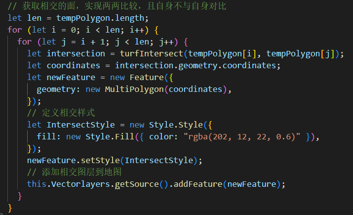
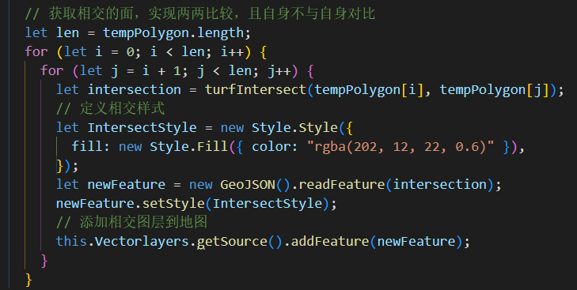

# 地图

1. vue 使用 openlayer 时，如果是动态绑定的 id，只要有表单绑定等触发 vue 的更新机制，就会导致 openlayer 地图无法拖拽、缩放无效、可能出现空白页面等问题。需使用 computed 进行替换动态 id 操作。

2. 百度地图，如果地图容器存在以下代码`transform: translate(-50%,-50%)`，会出现地图缩放中心点偏移，原因百度地图默认定位是取浏览器文档对象的 scrollTop=0 的位置，需要进行调整。

3. 通过 turf.js 取得的相交区域，返回的是一个 JSON，类型可能是 MultiPolygon | Polygon。图一读取有问题，采取图二的。
<div style="overflow: hidden">
<div style="float:left;"></div>
<div style="float:left;"></div>
</div>

4. openlayers 的绘制圆圈的默认单位是根据投影而来，并非米，需要转换！！！

```js
// 绘制圆
drawCircle(radius, wktData) {
  if (this.circleLayer) this.map.removeLayer(this.circleLayer);

  if (!wktData) return;

  let center = null;
  if (wktData) {
    let obj = this.getCenterAndExtentByWKT({ wkt: wktData }); // 通过wkt的数据获取中心点
    center = obj.center;
  }

  if (!center) return;

  const circleFeature = new Feature({
    geometry: new Circle(center, this.getRadius(radius)),
  });

  circleFeature.setStyle(
    new Style.Style({
      renderer(coordinates, state) {
        const [[x, y], [x1, y1]] = coordinates;
        const ctx = state.context;
        const dx = x1 - x;
        const dy = y1 - y;
        const radius = Math.sqrt(dx * dx + dy * dy);

        const innerRadius = 0;
        const outerRadius = radius * 1;

        const gradient = ctx.createRadialGradient(
          x,
          y,
          innerRadius,
          x,
          y,
          outerRadius
        );
        gradient.addColorStop(0, "rgba(255,0,0,0)");
        gradient.addColorStop(0.8, "rgba(255,0,0,0.2)");
        gradient.addColorStop(1, "rgba(255,0,0,0.2)");
        ctx.beginPath();
        ctx.arc(x, y, radius, 0, 2 * Math.PI, true);
        ctx.fillStyle = gradient;
        ctx.fill();

        ctx.arc(x, y, radius, 0, 2 * Math.PI, true);
        ctx.strokeStyle = "rgba(255,0,0,0.5)";
        ctx.stroke();
      },
    })
  );

  let newLayer = new VectorLayer({
    source: new VectorSource({ features: [circleFeature] }),
    zIndex: 98,
  });
  this.circleLayer = newLayer;
  this.map.addLayer(newLayer);

  let [x, y] = this.map.getSize();
  this.map.getView().fit(circleFeature.getGeometry(), {
    duration: 400,
    size: [x - 200, y - 100],
  });
}

// 将投影得到的单位转换成米
getRadius(radius) {
  let metersPerUnit = this.map.getView().getProjection().getMetersPerUnit();
  let circleRadius = radius / metersPerUnit;
  return circleRadius;
},
```
