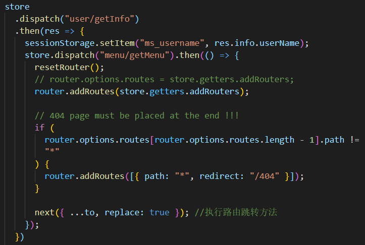

# Vue
## 表单问题
ElementUI 表单校验 number 类型的浮点数，因为 v-model 返回的是字符串，加修饰符 .number 后无法输入小数点，故需要手写自定义校验规则。

```vue
const fn = (rule, value, callback) { 
    if (!value) { 
        return callback(new Error("xxxx")); 
    } 
    let reg = /^\d*(\.?\d+)$/; 
    if (!reg.test(value)) { 
        return callback(new Error("xxx")) 
    } 
    return callback(); 
}
```

## 路由
1. 动态路由加载的时候，刷新后会出现 404，404 的路由组件务必要放在最后。{ width=50% height=auto }
2. 懒加载 + 异步（请求）会导致通过 ref 方式获取数据有问题（第一次 undefined，更新后还是拿不到，人才公园 SwiperImg 组件）。
   - 解决办法，正常引入组件或者更改逻辑使用 emit。
3. this.$router.replace({ path: "/home" }); // 首次登录会报错。原因：多次重定向，login -> / -> /baseData -> /home，加上 catch 强制忽略掉, 具体参考：[stackoverflow](https://stackoverflow.com/questions/62223195/vue-router-uncaught-in-promise-error-redirected-from-login-to-via-a?rq=1)   
解决办法：
    - ```this.$router.replace({ path: "/home" }).catch(_ => {});```
    - ```this.$router.push({ path: "/home", replace: true })```
    - ```router-link```
4. 路由重复 push/replace 报错 ```NavigationDuplicated:Avoided redundant navigation！```
```router.js
import VueRouter from "vue-router";
Vue.use(VueRouter);

const originalPush = VueRouter.prototype.push;
VueRouter.prototype.push = function push(location, onResolve, onReject) {
  if (onResolve || onReject)
    return originalPush.call(this, location, onResolve, onReject);
  return originalPush.call(this, location).catch((err) => err);
};

const originalReplace = VueRouter.prototype.replace;
VueRouter.prototype.replace = function replace(location, onResolve, onReject) {
  if (onResolve || onReject)
    return originalReplace.call(this, location, onResolve, onReject);
  return originalReplace.call(this, location).catch((err) => err);
};

```